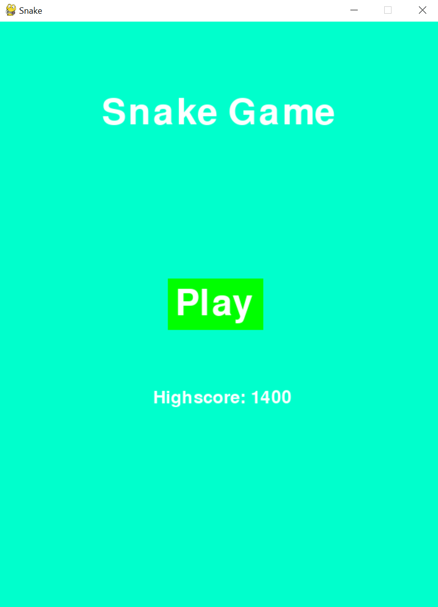
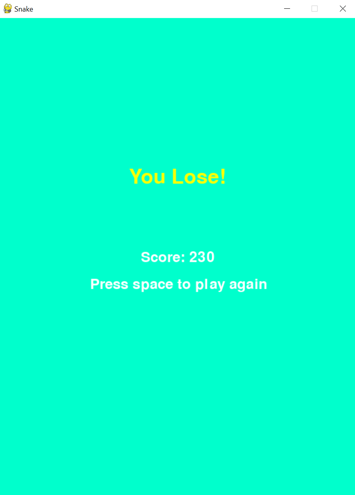
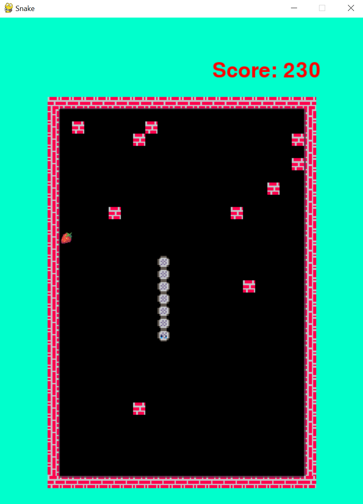

# Змейка 🐍

Добро пожаловать в классическую игру "Змейка", переписанную с современным подходом и новыми фишками! Проверь свои навыки и попробуй побить рекорд.

## 🎮 Демонстрация геймплея

Посмотри, как работает игра в действии:

## 🚀 Функциональные возможности

- **Увеличение скорости:** Чем дольше играешь, тем быстрее движется змейка.
- **Сложность игры:** На поле периодически появляются препятствия.
- **Разнообразные фрукты и ягоды:** Добавлены различные спрайты и количество очков.
- **Хранение рекордов:** Следи за своими лучшими результатами.

## 🎮 Как играть

- **Цель:** Управляй змейкой, собирай фрукты и старайся не врезаться в стены или в себя.
- **Управление:**
  - `W` или `↑` - вверх
  - `S` или `↓` - вниз
  - `A` или `←` - влево
  - `D` или `→` - вправо

## 📸 Скриншоты

    

## © Лицензия

Этот проект распространяется под лицензией MIT. Подробнее см. файл [LICENSE](LICENSE).

## 👨‍💻 Автор

- [Aptukov Mikhail - github](https://github.com/LuckyAm20)